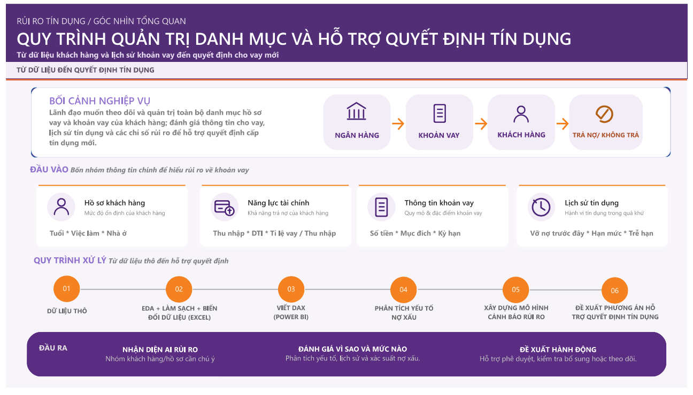
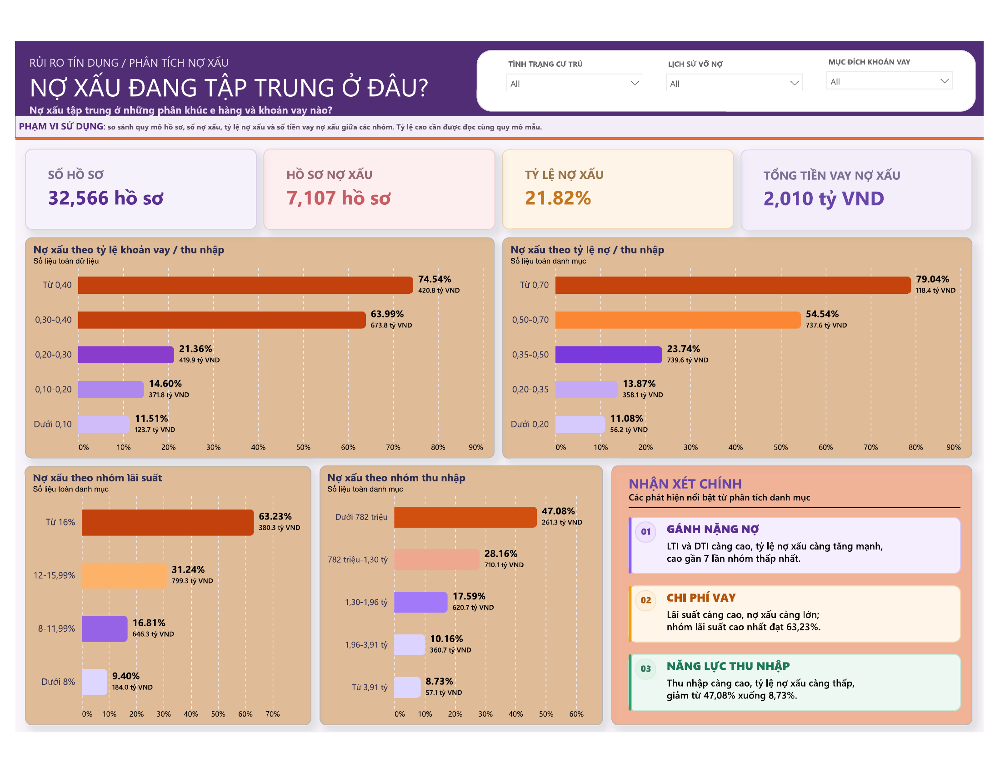
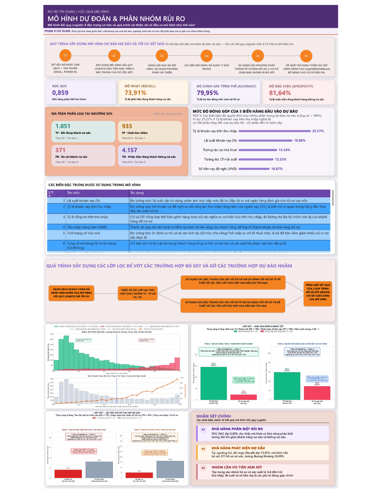
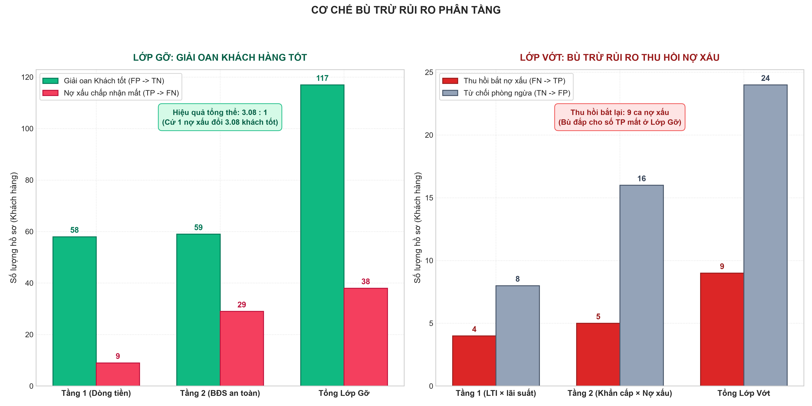
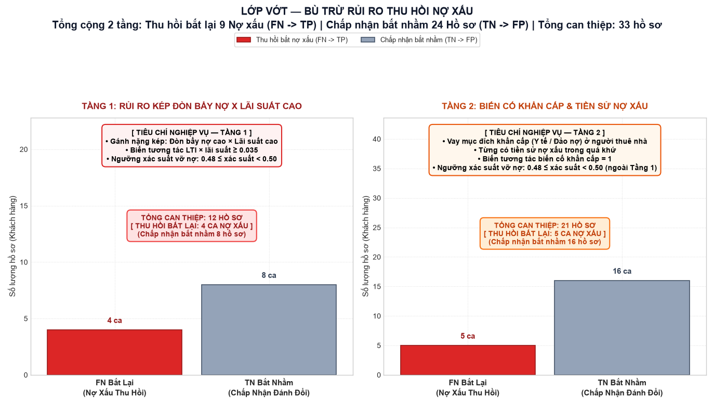
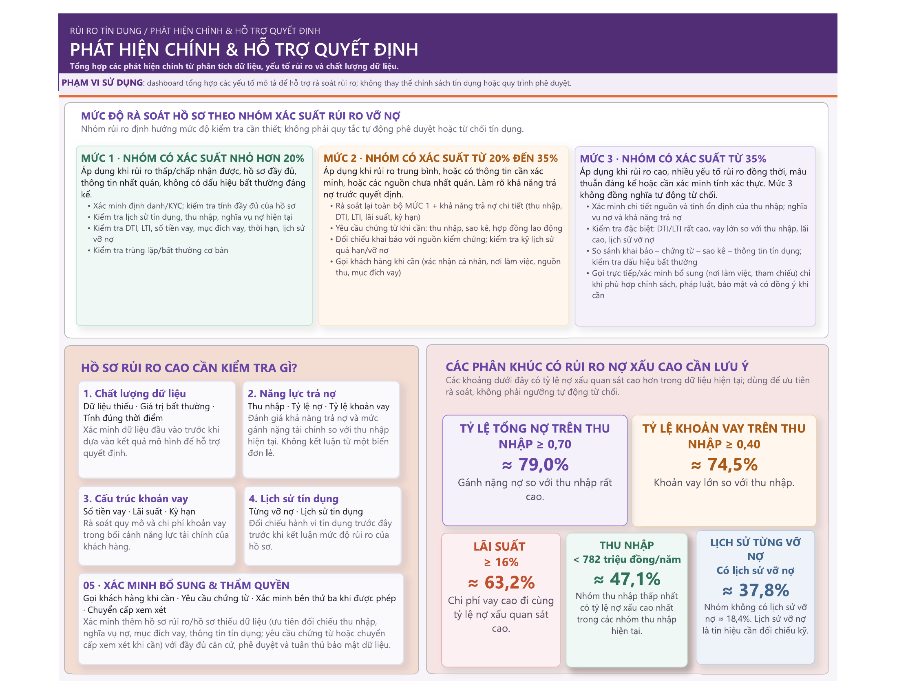

<div align="center">

# Credit Risk Analytics & Default Prediction

### Data Analytics + Machine Learning | Power BI | Python | PostgreSQL

<p>
  
  
  
  
  
</p>

<p>
  <strong>10/08/2026 – Present</strong>
</p>

<p>
  An end-to-end <strong>Data Analytics + Machine Learning</strong> project for
  credit-risk analysis, default prediction, model evaluation, and risk-review support.
</p>

</div>

---

## 🔎 Project Overview

This project is intentionally built around two connected perspectives:

| 📊 Data Analytics | 🤖 Machine Learning |
|---|---|
| Understand where default risk is concentrated | Estimate default probability |
| Segment customers and loans by risk dimensions | Evaluate model performance |
| Analyze LTI, DTI, interest rate, income and credit history | Investigate FP / FN cases |
| Build Power BI dashboards and business findings | Group applications by observed/modelled risk |

The final Power BI report brings these two perspectives together to support **credit-risk review and decision support**. It is not intended to replace a bank's formal credit policy or automatically approve/reject applications.

### Project Timeline
**02/04/2026 – 3/09/2026**

---

## 🧭 End-to-End Workflow

```text
Raw Credit Data
      │
      ▼
Data Preparation & EDA
      │
      ▼
Derived Risk Metrics
      │
      ▼
Power BI Business Analysis
      │
      ▼
Logistic Regression
      │
      ▼
Model Evaluation
      │
      ▼
False Positive / False Negative Analysis
      │
      ▼
Rule-Based Risk Adjustment
      │
      ▼
Risk Review & Decision Support
```

---

# 📊 Data Analytics

## 1. Data Understanding

The project starts by understanding four main groups of information used to describe credit risk:

| Data Group | Examples | Purpose |
|---|---|---|
| Customer profile | Age, employment, housing | Understand customer stability |
| Financial capacity | Income, DTI, LTI | Evaluate repayment capacity |
| Loan information | Loan amount, purpose, term, interest rate | Understand loan size and cost |
| Credit history | Previous default, credit history, late payment | Understand past credit behaviour |

The Power BI report includes a dedicated **Data Dictionary** page explaining the meaning and usage of important variables and model terminology.

---

## 2. Derived Risk Metrics

Several metrics are derived to make the credit analysis more interpretable.

### DTI — Debt-to-Income Ratio

```text
DTI = (Loan Amount + Other Debt) / Annual Income
```

Represents the overall debt burden relative to annual income.

### LTI — Loan-to-Income Ratio

```text
LTI = Loan Amount / Annual Income
```

Measures the size of the requested loan relative to annual income.

### Default Rate

```text
Default Rate = Number of Default Cases / Total Cases
```

These metrics are used throughout the Power BI analysis and the modelling workflow.

---

# 📈 Power BI Dashboard

Power BI is a **major deliverable** of the project rather than a visualization layer added after the ML model.

The report contains **five main analytical pages**.

## 1. Overview — Credit Risk Management

<div align="center">



</div>

The overview presents the business context and the end-to-end process from customer/loan data to credit decision support.

```text
Data → Analysis → Risk Factors → Model → Risk Review → Decision Support
```

---

## 2. Data Dictionary

The Data Dictionary documents:

- Important dataset columns
- Derived metrics such as DTI and LTI
- PD (Probability of Default)
- ROC-AUC
- TP / TN / FP / FN
- Risk groups
- Classification threshold
- Model coefficients

---

## 3. Credit Default Analysis

<div align="center">



</div>

This is the main **Data Analytics** section of the dashboard.

### Main dimensions analyzed

`LTI` · `DTI` · `Interest Rate` · `Income` · `Housing Status` · `Previous Default History` · `Loan Purpose`

### Portfolio Snapshot

| KPI | Result |
|---|---:|
| Total applications | **32,566** |
| Default cases | **7,107** |
| Observed default rate | **21.82%** |
| Default-loan value | **~2,010 billion VND** |

> These figures describe the dataset used in the Power BI report. A high observed rate within a segment should be interpreted together with its sample size and portfolio context.

### Key Observed Patterns

1. **Higher LTI is associated with higher observed default rates.**
2. **Higher DTI is associated with higher observed default rates.**
3. **Higher interest-rate groups show higher observed default rates.**
4. **Lower-income groups show higher observed default rates.**

> These are descriptive findings from the dataset and should not be interpreted as causal effects by themselves.

---

# 🤖 Machine Learning

## 4. Default Prediction Model

<div align="center">



</div>

The ML component uses **Logistic Regression** to estimate the probability that a credit application belongs to the default class.

### Modelling Workflow

```text
Cleaned Data
    ↓
Baseline Logistic Regression
    ↓
Feature Engineering
    ↓
Log Transformation for Skewed Variables
    ↓
StandardScaler
    ↓
Logistic Regression with 23 Features
    ↓
Default Probability
    ↓
Risk Group / Classification
```

### Model Features

The current core model uses **23 features**, including:

- Loan interest rate
- LTI
- DTI
- Annual income
- Housing status
- Previous default history
- Requested loan amount
- Financial and interaction features

---

## 5. Model Evaluation

<div align="center">

<table>
<tr>
<td align="center"><strong>ROC-AUC</strong><br><big>0.859</big></td>
<td align="center"><strong>Recall</strong><br><big>73.91%</big></td>
<td align="center"><strong>Accuracy</strong><br><big>79.95%</big></td>
<td align="center"><strong>Specificity</strong><br><big>81.64%</big></td>
</tr>
</table>

</div>

### Confusion Matrix

|  | Predicted Default | Predicted Non-default |
|---|---:|---:|
| **Actual Default** | **1,051 TP** | **371 FN** |
| **Actual Non-default** | **935 FP** | **4,157 TN** |

These metrics evaluate both the model's discrimination ability and the practical trade-off between missed defaults and false alarms.

---

# 🧠 Model Interpretation

The Power BI report presents the relative contribution of the leading model variables:

| Variable | Reported contribution |
|---|---:|
| Loan-to-Income Ratio (LTI) | **25.27%** |
| Loan Interest Rate | **18.88%** |
| Rent-related interaction | **13.54%** |
| LTI × Interest Rate interaction | **12.23%** |
| Requested Loan Amount | **10.87%** |

The project uses these outputs to connect the ML model back to the business analysis instead of treating the model as a black box.

---

# ⚠️ False Positive / False Negative Analysis

<div align="center">



</div>

A key part of the ML workflow is analyzing where the model makes mistakes.

```text
Model Prediction
      ↓
Confusion Matrix
      ↓
┌─────────────────────┐
│ False Positive (FP) │
│ False Negative (FN) │
└─────────────────────┘
      ↓
Rule-Based Risk Adjustment
      ↓
Final Risk Review Output
```

### False Positive (FP)

A non-default case incorrectly receives a default warning.

<div align="center">


</div>

### False Negative (FN)

A default case is incorrectly classified as non-default.

<div align="center">



</div>

The project compares the characteristics of FP cases with TN cases and FN cases with TP cases to design additional review rules.

---

# 🛠️ Risk Adjustment Layer

The final processing stage applies rule-based review logic on top of the core Logistic Regression model.

```text
Core Logistic Regression
          ↓
    Default Prediction
          ↓
      FP / FN Analysis
          ↓
  Risk Adjustment Layers
          ↓
   Final Evaluation Output
```

Two complementary review processes are used:

- **FP review** — examine cases flagged as risky that may resemble correctly classified non-default cases.
- **FN review** — examine missed default cases and identify characteristics that may justify additional review.

> This layer should be understood as **decision-support logic**, not as an automatic credit approval/rejection policy.

---

# 🎯 Risk Groups & Decision Support

<div align="center">



</div>

The Power BI report groups applications by estimated probability of default and maps the groups to different levels of review.

### Review Level 1
Lower estimated risk and a complete, consistent application.

### Review Level 2
Medium estimated risk or cases requiring additional clarification.

### Review Level 3
Higher estimated risk or cases with multiple risk signals or significant inconsistencies.

> These groups are **review guidance rather than automatic approval/rejection rules**.

---

# 🔗 Data Analytics + Machine Learning Integration

The main strength of this project is the connection between descriptive analytics and predictive modelling.

```text
                       CREDIT RISK DATA
                              │
              ┌───────────────┴───────────────┐
              │                               │
              ▼                               ▼
       DATA ANALYTICS                   MACHINE LEARNING
              │                               │
        ┌─────┴─────┐                   ┌─────┴─────┐
        │           │                   │           │
       EDA      Power BI          Feature Eng.  Logistic Reg.
        │           │                   │           │
        ▼           ▼                   ▼           ▼
   Risk Patterns  Business        Default Risk  Probability
   LTI / DTI      Findings         Prediction    Prediction
              │                               │
              └───────────────┬───────────────┘
                              ▼
                     FP / FN Analysis
                              │
                              ▼
                  Rule-Based Risk Adjustment
                              │
                              ▼
                       Decision Support
```

This allows the project to answer two connected questions:

> **Data Analytics:** Where is credit risk concentrated and what patterns can be observed in the portfolio?

> **Machine Learning:** Can a model estimate default risk for individual applications and how reliable are those predictions?

---

# 🗂️ End-to-End Project Structure

```text
159/
│
├── README.md
├── Phân tích nợ xấu.pdf
│
├── docs/
│   ├── PIPELINE.md
│   ├── HIEN_TRANG_HE_THONG.md
│   └── NHAT_KY_CONG_VIEC.md
│
├── readme/
│   ├── README DA.md
│   └── README ML.md
│
└── repo_source/
    ├── step_1/
    ├── step_2/
    ├── step_3/
    ├── step_4/
    └── step_5/
```

---

# 🗄️ PostgreSQL Integration

The project includes PostgreSQL integration for storing intermediate and model-related outputs.

```text
Database Schema
└── credit_model
```

Relevant scripts:

```text
repo_source/db_import.py
repo_source/db_save_model.py
```

The Power BI semantic model is connected to outputs from the pipeline through the project's synchronization workflow.

---

# 🧰 Tools & Technologies

| Area | Tools |
|---|---|
| **Data Analytics** | Power BI · DAX · Excel · EDA · Data Cleaning · Data Visualization |
| **Machine Learning** | Python · pandas · scikit-learn · Logistic Regression · Feature Engineering · StandardScaler · Log Transformation |
| **Data / Engineering** | PostgreSQL · CSV / Excel Processing · Model Serialization · Git / GitHub |

---

# 📚 What I Learned

### Data Analytics

- Translating a business problem into analytical questions
- Building derived financial indicators such as DTI and LTI
- Segmenting a portfolio by meaningful risk dimensions
- Building Power BI dashboards around KPIs and business questions
- Turning exploratory results into concise business findings

### Machine Learning

- Building a Logistic Regression baseline
- Designing financial and interaction features
- Handling skewed variables with transformation
- Standardizing model inputs
- Evaluating ROC-AUC, Recall, Accuracy and Specificity
- Reading confusion matrices and investigating FP/FN cases

### Analytics + ML

- Connecting descriptive patterns with model outputs
- Interpreting model features in a business context
- Using error analysis to design additional review rules
- Communicating model results as decision-support information

---

# ⚠️ Limitations & Responsible Use

This project is a portfolio/analytical implementation and should not be treated as a production credit-decision system.

- Observed relationships in the dataset do not by themselves establish causality.
- Risk-group thresholds are review guidance, not automatic approval/rejection rules.
- Model performance depends on the dataset and evaluation setup.
- The current Logistic Regression model may not capture nonlinear relationships as well as more advanced models.
- The Power BI report is intended to support human review rather than replace credit policy, compliance requirements or professional judgement.
- The Power BI semantic model and database may require synchronization after pipeline changes.

---

# 📖 Documentation

- [`PIPELINE.md`](docs/PIPELINE.md) — end-to-end processing pipeline and model workflow
- [`HIEN_TRANG_HE_THONG.md`](docs/HIEN_TRANG_HE_THONG.md) — current system/database state
- [`NHAT_KY_CONG_VIEC.md`](docs/NHAT_KY_CONG_VIEC.md) — project work log
- [`Phân tích nợ xấu.pdf`](Phân%20tích%20nợ%20xấu.pdf) — exported Power BI report

---

## 💼 Skills Demonstrated

<div align="center">

`Data Analysis` · `EDA` · `Power BI` · `DAX` · `Excel` · `Business Intelligence` ·  
`Python` · `pandas` · `scikit-learn` · `Logistic Regression` · `Feature Engineering` ·  
`Model Evaluation` · `PostgreSQL` · `Risk Analytics` · `Decision Support`

</div>

---

<div align="center">

### Author

**Đức**

_Data Analyst / Data Science Portfolio_

**Project Timeline:** 10/08/2026 – Present

</div>
