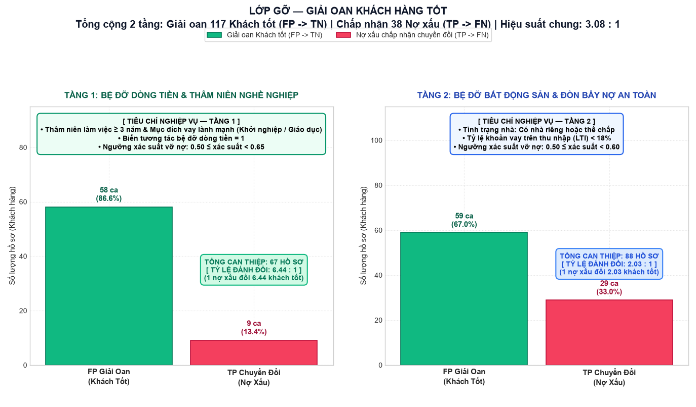

Credit Risk Analytics & Default Prediction

An end-to-end **Data Analytics + Machine Learning** project for analyzing credit risk, identifying default patterns, building a default prediction model, and translating analytical and model outputs into risk-review insights.

The project is intentionally built around two connected perspectives:

- **Data Analytics** — understand where default risk is concentrated, which customer/loan segments show higher observed default rates, and what factors should be investigated.
- **Machine Learning** — estimate default probability, evaluate model performance, analyze false positives/false negatives, and group applications by observed/modelled risk.

The final Power BI report brings these two perspectives together to support **credit-risk review and decision support**. It is not intended to replace a bank's formal credit policy or automatically approve/reject applications.

> **Project Timeline:** 10/08/2026 – Present



## Project Overview

The project uses a credit-risk dataset containing **32,566 records and 29 columns**. The target variable is:

```text
Trạng thái trả nợ
0 = không vỡ nợ
1 = vỡ nợ
```

The analytical workflow covers:

```text
Raw Credit Data
      ↓
Data Preparation & EDA
      ↓
Derived Risk Metrics
      ↓
Power BI Business Analysis
      ↓
Logistic Regression
      ↓
Model Evaluation
      ↓
False Positive / False Negative Analysis
      ↓
Rule-Based Risk Adjustment
      ↓
Risk Review & Decision Support
```

---

# Data Analytics

## 1. Data Understanding

The project starts by understanding four main groups of information used to describe credit risk:

| Data Group | Examples | Purpose |
|---|---|---|
| Customer profile | Age, employment, housing | Understand customer stability |
| Financial capacity | Income, DTI, LTI | Evaluate repayment capacity |
| Loan information | Loan amount, purpose, term, interest rate | Understand loan size and cost |
| Credit history | Previous default, credit history, late payment | Understand past credit behaviour |

The Power BI report includes a dedicated **Data Dictionary** page explaining the meaning and usage of important variables and model terminology.

---

## 2. Derived Risk Metrics

Several metrics are derived to make the credit analysis more interpretable.

### Debt-to-Income Ratio (DTI)

```text
DTI = (Loan Amount + Other Debt) / Annual Income
```

DTI represents the overall debt burden relative to annual income.

### Loan-to-Income Ratio (LTI)

```text
LTI = Loan Amount / Annual Income
```

LTI measures the size of the requested loan relative to annual income.

### Default Rate

```text
Default Rate = Number of Default Cases / Total Cases
```

These metrics are used throughout the Power BI analysis and the modelling workflow.

---

# Power BI Dashboard

The Power BI report is a major deliverable of the project rather than a visualization layer added after the ML model.

The report contains **five main analytical pages**.

## 1. Overview — Credit Risk Management

The overview page presents the business context and the end-to-end process from customer/loan data to credit decision support.

It explains:

- The business problem
- Four major data groups
- The analytics and modelling workflow
- How analytical findings are translated into risk-review actions

```text
Data → Analysis → Risk Factors → Model → Risk Review → Decision Support
```

---

## 2. Data Dictionary

This page documents:

- Important dataset columns
- Derived metrics such as DTI and LTI
- PD (Probability of Default)
- ROC-AUC
- TP / TN / FP / FN
- Risk groups
- Classification threshold
- Model coefficients

This makes the dashboard easier to interpret before using its analytical results.

---

## 3. Credit Default Analysis

This is the main **Data Analytics** section of the dashboard.

The analysis compares portfolio size, default volume, default rate and default-loan value across different segments.

### Main dimensions analyzed

- LTI groups
- DTI groups
- Interest-rate groups
- Income groups
- Housing status
- Previous default history
- Loan purpose

### Portfolio-level figures shown in the report

- **32,566** total applications
- **7,107** default cases
- **21.82%** observed default rate
- Approximately **2,010 billion VND** in default-loan value

> These figures describe the dataset used in the Power BI report. A high observed rate within a segment should be interpreted together with its sample size and portfolio context.

### Key observed patterns

The dashboard highlights several patterns in the current dataset:

1. **Higher LTI is associated with higher observed default rates.**
2. **Higher DTI is associated with higher observed default rates.**
3. **Higher interest-rate groups show higher observed default rates.**
4. **Lower-income groups show higher observed default rates.**

These are descriptive findings from the dataset and should not be interpreted as causal effects by themselves.

---

# Machine Learning

## 4. Default Prediction Model

The ML component uses **Logistic Regression** to estimate the probability that a credit application belongs to the default class.

The modelling workflow progresses from a baseline model to a feature-engineered model.

```text
Cleaned Data
    ↓
Baseline Logistic Regression
    ↓
Feature Engineering
    ↓
Log Transformation for Skewed Variables
    ↓
StandardScaler
    ↓
Logistic Regression with 23 Features
    ↓
Default Probability
    ↓
Risk Group / Classification
```

### Model features

The Power BI report documents the main variables used by the model, including:

- Loan interest rate
- LTI
- DTI
- Annual income
- Housing status
- Previous default history
- Requested loan amount
- Financial and interaction features

The current core model uses **23 features**: original variables, derived financial variables and interaction features.

---

## 5. Model Evaluation

The Power BI report presents the following model results for the evaluated test set:

| Metric | Reported Result |
|---|---:|
| ROC-AUC | **0.859** |
| Recall | **73.91%** |
| Accuracy | **79.95%** |
| Specificity | **81.64%** |

At the classification threshold shown in the report, the confusion matrix is:

| | Predicted Default | Predicted Non-default |
|---|---:|---:|
| **Actual Default** | 1,051 TP | 371 FN |
| **Actual Non-default** | 935 FP | 4,157 TN |

These metrics are used to evaluate both the model's discrimination ability and the practical trade-off between missed defaults and false alarms.

---

# Model Interpretation

The Power BI report also presents the relative contribution of the leading model variables.

The five leading variables shown are:

| Variable | Reported contribution |
|---|---:|
| Loan-to-Income Ratio (LTI) | **25.27%** |
| Loan Interest Rate | **18.88%** |
| Rent-related interaction | **13.54%** |
| LTI × Interest Rate interaction | **12.23%** |
| Requested Loan Amount | **10.87%** |

The project uses these outputs to connect the ML model back to the business analysis instead of treating the model as a black box.

---

# False Positive / False Negative Analysis

A key part of the ML workflow is analyzing where the model makes mistakes.

```text
Model Prediction
      ↓
Confusion Matrix
      ↓
 ┌───────────────┬───────────────┐
 │ False Positive │ False Negative│
 │   FP review    │   FN review   │
 └───────────────┴───────────────┘
      ↓
Rule-Based Risk Adjustment
      ↓
Final Risk Review Output
```

### False Positive (FP)

A non-default case incorrectly receives a default warning.

### False Negative (FN)

A default case is incorrectly classified as non-default.

The project compares the characteristics of FP cases with TN cases and FN cases with TP cases to design additional review rules.

This is documented in the pipeline as a **Risk Adjustment** layer rather than treating it as a separate ML model.

---

# Risk Adjustment Layer

The final processing stage applies rule-based review logic on top of the core Logistic Regression model.

The purpose is to examine selected FP/FN cases and evaluate whether additional characteristics suggest that a case deserves a different review treatment.

```text
Core Logistic Regression
          ↓
   Default Prediction
          ↓
   FP / FN Analysis
          ↓
 Rule-Based Risk Adjustment
          ↓
 Final Evaluation Output
```

The project documentation records two complementary review processes:

- **FP review** — examine cases flagged as risky that may resemble correctly classified non-default cases.
- **FN review** — examine missed default cases and identify characteristics that may justify additional review.

This layer should be understood as **decision-support logic**, not as an automatic credit approval/rejection policy.

---

# Risk Groups & Decision Support

The Power BI report groups applications by estimated probability of default and maps the groups to different levels of review.

The dashboard explicitly states that these groups are **review guidance rather than automatic approval/rejection rules**.

### Review Level 1

Lower estimated risk and a complete, consistent application.

Typical checks include:

- KYC / identity information
- Credit history
- Income and existing debt
- DTI and LTI
- Loan amount and purpose
- Basic data-quality checks

### Review Level 2

Medium estimated risk or cases requiring additional clarification.

Typical checks include:

- More detailed repayment-capacity review
- Income documentation
- Bank statements or employment documents when appropriate
- Cross-checking declared information with verification sources

### Review Level 3

Higher estimated risk or cases with multiple risk signals or significant inconsistencies.

Typical checks include:

- Detailed income and debt verification
- High DTI / LTI review
- Large loan relative to income
- High interest-rate exposure
- Previous default history
- Additional verification where appropriate

---

# Data Analytics + Machine Learning Integration

The main strength of this project is the connection between descriptive analytics and predictive modelling.

```text
                         CREDIT RISK DATA
                                │
                ┌───────────────┴───────────────┐
                │                               │
                ▼                               ▼
         DATA ANALYTICS                    MACHINE LEARNING
                │                               │
        ┌───────┴───────┐               ┌───────┴───────┐
        │               │               │               │
       EDA          Power BI         Feature Eng.    Logistic Reg.
        │               │               │               │
        ▼               ▼               ▼               ▼
   Risk Patterns   Business       Default Risk     Probability
   LTI / DTI       Findings        Prediction       Prediction
        │               │               │               │
        └───────────────┴───────┬───────┴───────────────┘
                                ▼
                      FP / FN Error Analysis
                                │
                                ▼
                     Rule-Based Risk Adjustment
                                │
                                ▼
                         Decision Support
```

This allows the project to answer two different but connected questions:

> **Data Analytics:** Where is credit risk concentrated and what patterns can be observed in the portfolio?

> **Machine Learning:** Can a model estimate default risk for individual applications and how reliable are those predictions?

---

# End-to-End Workflow

```text
01  Raw Credit Dataset
          ↓
02  Data Cleaning & Train/Test Split
          ↓
03  Baseline Logistic Regression
          ↓
04  Feature Engineering & Core Model
          ↓
05  Model Evaluation
          ↓
06  Power BI Risk Analysis
          ↓
07  FP / FN Error Analysis
          ↓
08  Rule-Based Risk Adjustment
          ↓
09  Risk Groups & Review Guidance
```

The official project pipeline is documented in [`docs/PIPELINE.md`](docs/PIPELINE.md).

---

# PostgreSQL Integration

The project also includes PostgreSQL integration for storing intermediate and model-related outputs.

The documented database schema is:

```text
credit_model
```

The project includes scripts for importing pipeline outputs and saving model information.

Relevant scripts include:

```text
repo_source/db_import.py
repo_source/db_save_model.py
```

The Power BI semantic model is connected to outputs from the pipeline through the project's synchronization workflow.

> The repository documentation notes that the database and Power BI semantic model may require a fresh synchronization after pipeline-version changes. The README therefore treats the Power BI report as the documented analytical output rather than claiming that every stored database table is currently synchronized with the latest pipeline version.

---

# Project Structure

```text
159/
│
├── README.md
│
├── Phân tích nợ xấu.pdf
│
├── docs/
│   ├── PIPELINE.md
│   ├── HIEN_TRANG_HE_THONG.md
│   └── NHAT_KY_CONG_VIEC.md
│
├── readme/
│   ├── README DA.md
│   └── README ML.md
│
└── repo_source/
    ├── step_1/
    ├── step_2/
    ├── step_3/
    ├── step_4/
    └── step_5/
```

The repository also contains the project's Python environment and generated pipeline artifacts. These are implementation details and are not required to understand the analytical workflow.

---

# Tools & Technologies

**Data Analytics**

- Power BI
- Excel
- DAX
- Exploratory Data Analysis
- Data Cleaning
- Data Visualization

**Machine Learning**

- Python
- pandas
- scikit-learn
- Logistic Regression
- Feature Engineering
- StandardScaler
- Log Transformation
- Model Evaluation

**Data / Engineering**

- PostgreSQL
- CSV / Excel data processing
- Model serialization
- Git / GitHub

---

# What I Learned

This project helped me practice the complete path from raw credit data to analytical and predictive outputs.

### Data Analytics

- Translating a business problem into analytical questions
- Building derived financial indicators such as DTI and LTI
- Segmenting a portfolio by meaningful risk dimensions
- Building Power BI dashboards around KPIs and business questions
- Turning exploratory results into concise business findings

### Machine Learning

- Building a Logistic Regression baseline
- Designing financial and interaction features
- Handling skewed variables with transformation
- Standardizing model inputs
- Evaluating ROC-AUC, Recall, Accuracy and Specificity
- Reading confusion matrices and investigating FP/FN cases

### Analytics + ML

- Connecting descriptive patterns with model outputs
- Interpreting model features in a business context
- Using error analysis to design additional review rules
- Communicating model results as decision-support information rather than treating predictions as automatic decisions

---

# Limitations & Responsible Use

This project is a portfolio/analytical implementation and should not be treated as a production credit-decision system.

Important limitations include:

- Observed relationships in the dataset do not by themselves establish causality.
- Risk-group thresholds are review guidance, not automatic approval/rejection rules.
- Model performance depends on the dataset and evaluation setup.
- The current Logistic Regression model may not capture nonlinear relationships as well as more advanced models.
- The Power BI report is intended to support human review rather than replace credit policy, compliance requirements or professional judgement.
- The repository documentation notes that the Power BI semantic model and database may require synchronization after pipeline changes.

The dashboard itself explicitly states that its outputs **do not replace formal credit policy or the credit-approval process**.

---

# Documentation

- [`PIPELINE.md`](docs/PIPELINE.md) — end-to-end processing pipeline and model workflow
- [`HIEN_TRANG_HE_THONG.md`](docs/HIEN_TRANG_HE_THONG.md) — current system/database state
- [`NHAT_KY_CONG_VIEC.md`](docs/NHAT_KY_CONG_VIEC.md) — project work log
- [`Phân tích nợ xấu.pdf`](Phân%20tích%20nợ%20xấu.pdf) — exported Power BI report

---

## Skills Demonstrated

**Data Analysis • Exploratory Data Analysis • Power BI • DAX • Excel • Data Visualization • Business Intelligence • Python • pandas • scikit-learn • Logistic Regression • Feature Engineering • Model Evaluation • PostgreSQL • Risk Analytics • Decision Support**

---

## Author

**Đức**

Data Analyst / Data Science Portfolio

**Project Timeline:** 10/08/2026 – Present
