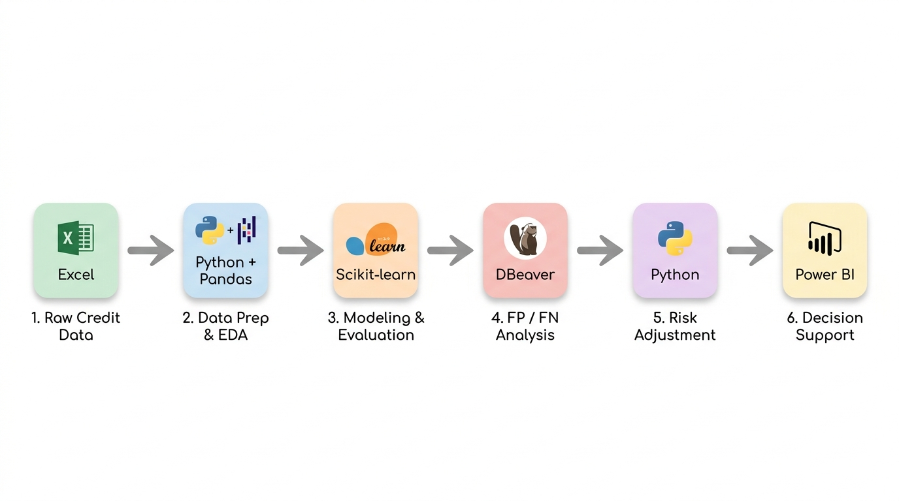

<div align="center">

# Credit Risk Analysis & Default Prediction

### Data Analytics + Machine Learning | Power BI | Python | PostgreSQL

<p>
  
  
  
  
  
</p>

<p>
  Một dự án <strong>Data Analytics + Machine Learning</strong> theo quy trình end-to-end,
  tập trung vào phân tích rủi ro tín dụng, dự đoán nợ xấu, model evaluation và hỗ trợ rà soát rủi ro.
</p>

</div>

---

## 📌 Project Overview

### 🏢 Business Context

Lãnh đạo cần một góc nhìn toàn diện về **loan portfolio của khách hàng** để theo dõi hồ sơ vay, đánh giá credit characteristics và quản lý các rủi ro tín dụng tiềm ẩn.

Dự án tổng hợp các thông tin quan trọng bao gồm **customer characteristics, loan information, credit history, repayment behavior và risk indicators**, từ đó cung cấp góc nhìn data-driven về portfolio quality và hỗ trợ quá trình đánh giá hồ sơ tín dụng mới.

### 🎯 Project Objective

Dự án kết hợp **Data Analysis và Data Science** nhằm:

- 📊 Theo dõi và phân tích tổng thể **loan portfolio**
- 🔍 Phân tích **customer characteristics và tín dụng**
- ⚠️ Xác định các yếu tố liên quan đến **rủi ro tín dụng**
- 🤖 Xây dựng mô hình dự đoán **probability of credit default**
- 📈 Phát triển bảng điều khiển tương tác nhằm hỗ trợ **portfolio monitoring và ra quyết định**

### 💡 Project Outcome

Giải pháp cuối cùng tích hợp **phân tích nghiệp vụ, visualization dữ liệu và Machine Learning** để cung cấp:

- **Business Insights** — Hiểu customer characteristics, đặc điểm khoản vay và các mô hình rủi ro trong danh mục.
- **Risk Analysis** — Xác định các yếu tố quan trọng liên quan đến rủi ro tín dụng và phân tích prediction results của mô hình.
- **Prediction Evaluation** — Ước tính probability of credit default bằng mô hình Machine Learning.
- **Hỗ trợ ra quyết định** — Cung cấp visualization tương tác và các phân tích data-driven để hỗ trợ đánh giá tín dụng và portfolio management.

Báo cáo Power BI cuối cùng kết hợp hai góc nhìn này nhằm hỗ trợ **credit risk review và ra quyết định**. Báo cáo không nhằm thay thế chính sách tín dụng chính thức của ngân hàng hoặc tự động phê duyệt/từ chối hồ sơ.

---

## 🔄 Credit Risk Analysis Workflow: From Raw Data to Actionable Insights

Dự án triển khai một **quy trình Phân tích Rủi ro Tín dụng end-to-end**, kết hợp **Data Analysis, Data Science, SQL và Trí tuệ kinh doanh (BI)** để chuyển đổi raw credit data thành các nhận xét có thể hành động nhằm hỗ trợ portfolio monitoring và credit decision-making.

<div align="center">
  
</div>

* **Bước 1 - Raw Credit Data (Microsoft Excel):**
  * Thu thập và quản lý dữ liệu thô bao gồm **hồ sơ vay, thông tin khách hàng, credit history, lịch sử khoản vay, dữ liệu giao dịch và dữ liệu tham chiếu**.

* **Bước 2 - Chuẩn Bị Dữ Liệu & phân tích dữ liệu khám phá (Python & Pandas):**
  * Thực hiện **data cleaning**, xử lý missing values, kiểm tra data quality, phân tích distributions và relationships between variables, đồng thời xác định các **mô hình và potential risk indicators** trước khi xây dựng mô hình.

* **Bước 3 - Model Building & Evaluation (Scikit-learn):**
  * Xây dựng mô hình phân loại **Logistic Regression** để dự đoán rủi ro tín dụng. Thực hiện train/test split, hyperparameter tuning và model evaluation bằng **Độ chính xác, Precision, Recall, F1-score, ROC-AUC và Confusion Matrix**.

* **Bước 4 - Phân Tích FP / FN (DBeaver - SQL):**
  * Sử dụng **SQL** để so sánh prediction results với actual outcomes, xác định các trường hợp **Trường Hợp Âm Tính Giả (FN)** và **Trường Hợp Dương Tính Giả (FP)**, đồng thời phân tích customer characteristics và khoản vay liên quan đến model misclassifications.

* **Bước 5 - Risk Adjustment (Python Rules):**
  * Áp dụng **các business rules** dựa trên kết quả phân tích FP/FN để điều chỉnh dự đoán của mô hình, tinh chỉnh risk classification và tạo ra **Điểm Rủi Ro / Phân Khúc Rủi Ro Cuối Cùng** phục vụ phân tích nghiệp vụ.

* **Bước 6 - Decision Support (Power BI):**
  * Xây dựng **biểu đồ bảng điều khiển Power BI tương tác** để visualization loan portfolio, risk segmentation, customer characteristics và key risk indicators, hỗ trợ **portfolio monitoring, đánh giá rủi ro và credit decision-making**.

---

# 📊 Data Analysis

## 1. Data Understanding

Dự án bắt đầu bằng việc tìm hiểu bốn nhóm thông tin chính được sử dụng để mô tả rủi ro tín dụng:

| Nhóm dữ liệu | Ví dụ | Mục đích |
|---|---|---|
| Hồ sơ khách hàng | Tuổi, việc làm, nhà ở | Đánh giá mức độ ổn định của khách hàng |
| Năng lực tài chính | Thu nhập, DTI, LTI | Đánh giá khả năng trả nợ |
| Thông tin khoản vay | Số tiền vay, mục đích, kỳ hạn, lãi suất | Hiểu quy mô và chi phí khoản vay |
| Credit History | Từng vỡ nợ, credit history, thanh toán trễ | Đánh giá hành vi tín dụng trong quá khứ |

Báo cáo Power BI có một trang **Từ Điển Dữ Liệu** riêng để giải thích ý nghĩa và cách sử dụng của các biến quan trọng cũng như các thuật ngữ trong mô hình.

---

## 2. Calculated Risk Metrics

Một số chỉ số được tính toán nhằm giúp việc phân tích tín dụng dễ diễn giải hơn.

### DTI — Debt-to-Income Ratio

```text
DTI = (Số tiền vay + Khoản nợ khác) / Thu nhập hàng năm
```

Phản ánh tổng gánh nặng nợ so với thu nhập hàng năm.

### LTI — Loan-to-Income Ratio

```text
LTI = Số tiền vay / Thu nhập hàng năm
```

Đo lường quy mô khoản vay yêu cầu so với thu nhập hàng năm.

### Tỷ Lệ Nợ Xấu

```text
Default Rate = Số trường hợp nợ xấu / Total số trường hợp
```

Các chỉ số này được sử dụng xuyên suốt quá trình phân tích trên Power BI và quy trình xây dựng mô hình.

---

## 3. Exploratory Data Analysis (phân tích dữ liệu khám phá) & Nhận xét

Giai đoạn phân tích danh mục tập trung giải quyết câu hỏi nghiệp vụ cốt lõi:

**"Nợ xấu đang tập trung ở đâu?"**

Phân tích các nhóm khách hàng và cấu trúc khoản vay trên toàn bộ **32,566 hồ sơ**.

<div align="center">
  
</div>

### 📌 Các chỉ số Total Quan Danh Mục

<div align="center">

| Total số hồ sơ | Hồ sơ nợ xấu | Default Rate tổng thể | Total tiền vay nợ xấu |
| :---: | :---: | :---: | :---: |
| **32,566** | **7,107** | **21.82%** | **2,010 tỷ VND** |

</div>

### 💡 Các Nhận xét Chiến Lược Chính

> [!IMPORTANT]
> **01. DEBT BURDEN (DEBT BURDEN):**
> * **Default Rate leo thang phi mã theo đòn bẩy tài chính:** Cả hai chỉ số LTI và DTI đều cho thấy mối quan hệ đồng biến cực mạnh với rủi ro vỡ nợ.
> * Nhóm vay có **LTI ≥ 0.40** ghi nhận tỷ lệ nợ xấu **74.54%** (cao gấp **6.5 lần** so với nhóm an toàn < 0.10 ở mức 11.51%).
> * Nhóm **DTI ≥ 0.70** có tỷ lệ nợ xấu chạm đỉnh **79.04%** (cao gấp **7.1 lần** nhóm < 0.20 ở mức 11.08%).
> * *Quy mô rủi ro:* Phân khúc **LTI từ 0.30 – 0.40** gánh lượng nợ xấu lớn nhất toàn danh mục với **673.8 tỷ VND**, trong khi phân khúc **DTI từ 0.35 – 0.70** tập trung tới **1,477.2 tỷ VND** nợ xấu.

> [!WARNING]
> **02. BORROWING COSTS (BORROWING COSTS):**
> * **Lãi suất cao tạo vòng xoáy mất khả năng thanh toán:** Lãi suất càng cao, nợ xấu càng nghiêm trọng. Nhóm khách hàng chịu lãi suất **≥ 16%** có tỷ lệ nợ xấu lên tới **63.23%**.
> * Nhóm lãi suất cận cao **12 – 15.99%** nắm giữ khối lượng tiền vay nợ xấu lớn nhất danh mục (**799.3 tỷ VND**, chiếm ~40% tổng dư nợ xấu), cho thấy chi phí vốn nặng nề trực tiếp bóp nghẹt rows tiền trả nợ hàng tháng.

> [!TIP]
> **03. EARNING CAPACITY (EARNING CAPACITY):**
> * **Lớp đệm thu nhập bảo vệ danh mục an toàn:** Default Rate nghịch biến rõ rệt với quy mô thu nhập của khách hàng.
> * Nhóm thu nhập thấp nhất (**< 782 triệu VND**) có tỷ lệ vỡ nợ lên tới **47.08%**, nhưng tỷ lệ này giảm liên tục xuống chỉ còn **8.73%** ở nhóm có thu nhập cao (**≥ 3.91 tỷ VND**).
> * Phân khúc khách hàng trung lưu (**782 triệu – 1.96 tỷ VND**) là nhóm tích tụ giá trị nợ xấu lớn nhất danh mục (**1,330.8 tỷ VND**), đòi hỏi quy trình thẩm định rows tiền chặt chẽ hơn thay vì chỉ dựa vào quy mô thu nhập danh nghĩa.

---

# 🤖 Machine Learning: Default Prediction

## 4. Model Architecture & Preprocessing Workflow

Model Framework dự đoán sử dụng **Logistic Regression** để ước tính **Probability Vỡ nợ (Xác Suất Vỡ Nợ - PD)**.

Workflow đảm bảo tính toàn vẹn dữ liệu thông qua **Chia phân tầng (80% Huấn luyện / 20% Kiểm tra)** dựa trên biến trạng thái trả nợ.

```text
Original Dataset (32,566 rows)
         │
         ▼  Chia Stratified 80/20
┌─────────────────────────┬─────────────────────────┐
│ Tập Huấn luyện (26,052 rows) │ Tập Kiểm tra (6,514 rows)  │
└─────────────────────────┴─────────────────────────┘
         │
         ▼
Dự đoán xác suất thô (Tập Kiểm Tra)
         │
         ▼
Risk Adjustment Layer (Ngưỡng LTI & Quy tắc nghiệp vụ)
         │
         ▼
Final Validated Credit Risk Assessment
```

---

## 5. Feature Importance & Variable Contribution

Level độ đóng góp tương đối của từng đặc trưng được định lượng bằng giá trị tuyệt đối chuẩn hóa của hệ số mô hình, được điều chỉnh theo độ lệch chuẩn của từng đặc trưng nhằm đảm bảo khả năng so sánh giữa các biến có thang đo khác nhau:

<div align="center">

| Xếp hạng | Feature Name | Contribution (%) | Business Interpretation |
| :---: | :--- | :---: | :--- |
| **01** | **Tỷ lệ Khoản vay / Thu nhập (LTI)** | **38.28%** | Yếu tố rủi ro chính: mức đòn bẩy quá cao so với khả năng thu nhập hàng năm. |
| **02** | **Lãi suất khoản vay (%)** | **28.16%** | Chi phí nợ trực tiếp làm gia tăng áp lực trả nợ hàng tháng. |
| **03** | **Số tiền vay yêu cầu (VND)** | **20.43%** | Quy mô mức độ tiếp xúc vốn: khoản vay lớn làm tăng mức độ tổn thất khi vỡ nợ. |
| **04** | **Thu nhập hàng năm (VND)** | **4.44%** | Năng lực tạo thu nhập và lớp đệm tài chính để trả nợ. |
| **05** | **Tình trạng sở hữu nhà** | **3.04%** | Chỉ báo về mức độ ổn định tài sản cá nhân và sức mạnh tài sản đảm bảo. |
| **06** | **Lịch sử từng vỡ nợ** | **2.77%** | Lịch sử quá hạn tín dụng và kỷ luật trả nợ trong quá khứ. |
| **07** | **Tỷ lệ Nợ / Thu nhập (DTI)** | **2.44%** | Total gánh nặng nợ từ nhiều nghĩa vụ tài chính. |
| **08** | **Mục đích khoản vay** | **0.43%** | Phân nhóm mục đích sử dụng nguồn vốn. |
| | **Total** | **100.00%** | **Top 3 đặc trưng chiếm 86.87% tổng trọng số quyết định của mô hình.** |

</div>

---

## 6. Model Evaluation & Performance Metrics

Mô hình được đánh giá trên **Tập Kiểm Tra chưa từng được sử dụng trong quá trình huấn luyện (6,514 hồ sơ)** sau khi tích hợp lớp điều chỉnh rủi ro ở Bước 5.

### 📈 Total Quan Hiệu Suất

<div align="center">

| Chỉ số | Kết quả | Industry Reference & Interpretation |
| :--- | :---: | :--- |
| **Độ chính xác (Độ chính xác)** | **94.80%** | Tỷ lệ phân loại chính xác tổng thể giữa khoản vay tốt và khoản vay xấu. |
| **ROC-AUC** | **0.8593** | Ability to discriminate giữa khách hàng vỡ nợ và không vỡ nợ. |
| **Recall (Sensitivity)** | **92.41%** | Correctly identifies **92.41%** tổng số trường hợp vỡ nợ thực tế trong danh mục. |
| **Precision** | **85.05%** | Khi mô hình cảnh báo rủi ro vỡ nợ, kết quả chính xác **85.05%** số lần. |
| **Specificity** | **95.46%** | Protects **95.46%** khách hàng có khả năng trả nợ khỏi việc bị từ chối nhầm. |
| **F1-Score** | **88.57%** | Balance giữa khả năng phát hiện rủi ro và duy trì khách hàng tốt. |
| **K-S Statistic** | **0.5850** | Separation ability mạnh giữa các nhóm rủi ro. |
| **PR-AUC** | **0.7450** | Reliability cao trong điều kiện dữ liệu tín dụng mất cân bằng (~21.8% nợ xấu). |
| **Brier Score / Log Loss** | **0.101 / 0.335** | Reliability của các xác suất dự đoán. |

</div>

### 🎯 Confusion Matrix (Tập Kiểm Tra: 6,514 Hồ Sơ)

<div align="center">

| | **Dự đoán: Nợ xấu (Cảnh báo rủi ro)** | **Dự đoán: Không nợ xấu (Được phê duyệt)** |
| :--- | :---: | :---: |
| **Thực tế: Nợ xấu (1,422 trường hợp)** | **1,314 TP** *(Phát hiện được nợ xấu)* | **108 FN** *(Bỏ sót nợ xấu)* |
| **Thực tế: Không nợ xấu (5,092 trường hợp)** | **231 FP** *(Cảnh báo nhầm)* | **4,861 TN** *(Khoản vay tốt được phê duyệt)* |

</div>

---

# 🔍 Deep-Dive Analysis: FP / FN Using SQL & Business Rule Adjustment

## 7. Error Audit & Cost-Sensitive Analysis (DBeaver / SQL)

### 🟢 1. Rescue Layer: FP → TN (*Clearing Good Customers*)

* **Scope:** `prediction_test_non_default.csv` (Toàn bộ **5,092 hồ sơ** thực tế không phát sinh nợ xấu).
* **Baseline trước điều chỉnh:**
  * **TN (Phê duyệt đúng):** **3,704 trường hợp**
  * **FP (Cảnh báo nhầm / Từ chối nhầm):** **1,388 trường hợp**
* **Adjustment Condition:**
  $$\mathbf{0.1987 \le LTI \le 0.342}$$
* **Cases Rescued:** **1,157 trường hợp** được chuyển từ **FP → TN** (các khách hàng có khả năng trả nợ được mở lại cơ hội vay).
* **Remaining Cases:** **231 trường hợp** vẫn là FP (giữ lại vùng đệm rủi ro thận trọng).
* **Post-Adjustment Result:**
  * **TN increases:** $3,704 \rightarrow \mathbf{4,861 \text{ trường hợp}}$
  * **FP decreases:** $1,388 \rightarrow \mathbf{231 \text{ trường hợp}}$ *(loại bỏ 83.36% cảnh báo nhầm)*

### 🔴 2. Catch Layer: FN → TP (*Catching Hidden Defaults*)

* **Scope:** `prediction_test_has_default.csv` (Toàn bộ **1,422 hồ sơ** thực tế phát sinh nợ xấu).
* **Baseline trước điều chỉnh:**
  * **TP (Đã phát hiện nợ xấu):** **865 trường hợp**
  * **FN (Bỏ sót nợ xấu / Rò rỉ):** **557 trường hợp**
* **Adjustment Condition:**
  $$\mathbf{0.0653 \le LTI \le 0.1907}$$
* **Cases Recovered:** **449 trường hợp** được chuyển từ **FN → TP** (giảm nguy cơ phát sinh tổn thất vốn nghiêm trọng).
* **Remaining Cases:** **108 trường hợp** vẫn là FN (được theo dõi và chuyển sang hội đồng tín dụng xem xét thủ công).
* **Post-Adjustment Result:**
  * **TP increases:** $865 \rightarrow \mathbf{1,314 \text{ trường hợp}}$
  * **FN decreases:** $557 \rightarrow \mathbf{108 \text{ trường hợp}}$ *(thu hồi 80.61% trường hợp nợ xấu bị bỏ sót)*

---

## 8. Decision Support System

### Review Level by Risk Probability

| Level | Probability | Review Process |
| :---: | :---: | :--- |
| 🟢 **1** | < 20% | Standard Review: xác minh KYC, kiểm tra thu nhập, DTI, LTI, mục đích vay, lịch sử vỡ nợ, trùng lặp hồ sơ. |
| 🟡 **2** | 20–35% | Enhanced Review (gồm toàn bộ Level 1): phân tích chi tiết khả năng trả nợ, yêu cầu chứng từ bổ sung (sao kê, hợp đồng lao động), cross-check chéo thông tin, gọi xác minh khi cần. |
| 🔴 **3** | ≥ 35% | In-Depth Assessment: xác minh nguồn thu nhập, kiểm tra DTI/LTI đặc biệt cao, cross-check Tờ khai ↔ Chứng từ ↔ Sao kê ↔ CIC. ⚠️ *Level 3 không đồng nghĩa tự động từ chối.* |

### What Should Be Checked for High-Risk Applications?

| # | Aspect | Key Indicators | Guidance |
| :---: | :--- | :--- | :--- |
| 01 | **Data Quality** | Thiếu · Bất thường · Lỗi thời | Verify input data trước khi dựa vào kết quả mô hình. |
| 02 | **Repayment Capacity** | Thu nhập · DTI · LTI | Đánh giá gánh nặng tài chính; do not conclude from a single variable. |
| 03 | **Loan Structure** | Số tiền vay · Lãi suất · Kỳ hạn | Rà soát quy mô và chi phí khoản vay so với năng lực tài chính. |
| 04 | **Credit History** | Từng vỡ nợ · Thâm niên tín dụng | Đối chiếu hành vi tín dụng trước đây trước khi kết luận mức độ rủi ro. |
| 05 | **Verification & Authority** | Chứng từ · Xác minh bên thứ ba | Xác minh hồ sơ rủi ro cao hoặc thiếu dữ liệu; escalate for review when necessary, strictly comply with data privacy requirements. |

### Segments with High Default Rates Requiring Priority Review

> *Used to guide in-depth review — not as an automatic rejection threshold.*

| Risk Segment | Observed Default Rate |
| :--- | :---: |
| Tỷ lệ tổng nợ / thu nhập (DTI) ≥ 0,70 | ≈ **79,0%** |
| Tỷ lệ khoản vay / thu nhập (LTI) ≥ 0,40 | ≈ **74,5%** |
| Lãi suất khoản vay ≥ 16% | ≈ **63,2%** |
| Thu nhập < 782 triệu đồng/năm | ≈ **47,1%** |
| Lịch sử từng vỡ nợ | ≈ **37,8%** *(vs. ~18,4% nhóm không vỡ nợ)* |

> **General Principle:** Conduct a multi-dimensional assessment (năng lực tài chính + cấu trúc khoản vay + hành vi tín dụng + chất lượng hồ sơ); do not use model probabilities for automatic rejection; comply with applicable laws và protect personal data trong mọi hoạt động xác minh.

---

## 9. Cấu Trúc Repository

```text
├── docs/
│   ├── PIPELINE.md               # Technical workflow specification end-to-end
│   ├── HIEN_TRANG_HE_THONG.md    # System architecture & implementation status
│   └── NHAT_KY_CONG_VIEC.md      # Project development log
├── images/
│   └── credit_risk_workflow.png  # Infographic quy trình độ phân giải cao
├── repo_source/
│   ├── step_1/                   # Nạp dữ liệu, làm sạch & chia stratified
│   ├── step_2/                   # Huấn luyện mô hình Logistic Regression baseline
│   ├── step_3/                   # Suy luận mô hình & phân tách prediction results
│   ├── step_4/                   # Kiểm tra FP/FN, phân tích đóng góp & ngưỡng LTI
│   ├── run_quy trình.py           # Script thực thi chính (Bước 1 đến 4)
│   ├── db_import.py              # Script nạp dữ liệu vào PostgreSQL
│   └── metrics_after_cut.py      # Script tính toán & kiểm tra metric cuối cùng
├── Phân tích nợ xấu.pbix         # File báo cáo bảng điều khiển Power BI tương tác
└── README.md                     # Project documentation
```

---

## 10. Execution & Reproduction Guide

### Requirements

* Python 3.10+
* PostgreSQL (Tùy chọn, dùng để lưu trữ dữ liệu)

### Installation

```bash
# Clone repository
git clone https://github.com/your-username/credit-risk-analytics.git
cd credit-risk-analytics

# Tạo và kích hoạt virtual environment
python -m venv venv

# Windows:
.\venv\Scripts\activate

# Linux/macOS:
source venv/bin/activate

# Install dependencies
pip install -r repo_source/requirements.txt
```

### Chạy Toàn Bộ Pipeline Từ đầu đến cuối

Thực thi toàn bộ quy trình dữ liệu từ bộ dữ liệu thô đến prediction results cuối cùng:

```bash
python repo_source/run_quy trình.py
```

### Kiểm Tra Các Metric Đánh Giá Cuối Cùng

```bash
python repo_source/metrics_after_cut.py
```

---

# 📚 What I Learned

### Data Analysis

- Translate business problems into analytical questions
- Build financial metrics such as DTI and LTI
- Segment the portfolio across meaningful risk dimensions
- Build a Power BI dashboard around KPIs and business questions
- Translate exploratory analysis results into concise business findings

### Machine Learning

- Xây dựng mô hình Logistic Regression baseline
- Design financial and interaction features
- Handle skewed variables using transformations
- Standardize model inputs
- Đánh giá ROC-AUC, Recall, Độ chính xác và Specificity
- Đọc Confusion Matrix và investigate cases FP/FN

### Data Analysis + Machine Learning

- Connect descriptive patterns với kết quả của mô hình
- Interpret model features in a business context
- Use error analysis to design additional review rules
- Communicate model results as decision-support information

---

# ⚠️ Limitations & Responsible Use

Dự án này là một portfolio implementation **danh mục/phân tích** và không nên được xem là một hệ thống credit decision-making vận hành thực tế.

- Các mối quan hệ quan sát được trong bộ dữ liệu không tự chúng chứng minh quan hệ nhân quả.
- Risk segmentation thresholds are intended only to guide review, not to serve as automatic approval/rejection rules.
- Hiệu suất mô hình phụ thuộc vào bộ dữ liệu và phương pháp đánh giá.
- The current Logistic Regression model may not capture nonlinear relationships as well as more advanced models.
- The Power BI report is intended to support human review rather than replace credit policy, compliance requirements, or professional judgment.
- Power BI mô hình ngữ nghĩa và cơ sở dữ liệu có thể cần được đồng bộ lại sau khi quy trình có thay đổi.

---

# 📖 Documentation

- [`PIPELINE.md`](docs/PIPELINE.md) — processing workflow end-to-end và model workflow
- [`HIEN_TRANG_HE_THONG.md`](docs/HIEN_TRANG_HE_THONG.md) — current system/database status
- [`NHAT_KY_CONG_VIEC.md`](docs/NHAT_KY_CONG_VIEC.md) — project execution log
- [`Phân tích nợ xấu.pdf`](Phân%20tích%20nợ%20xấu.pdf) — Power BI report exported as PDF

---

## 💼 Skills Demonstrated

<div align="center">

`Data Analysis` · `phân tích dữ liệu khám phá` · `Power BI` · `DAX` · `Excel` · `Trí tuệ kinh doanh` ·  
`Python` · `pandas` · `scikit-learn` · `Logistic Regression` · `Xây Dựng Đặc Trưng` ·  
`Đánh giá mô hình` · `PostgreSQL` · `Risk Analysis` · `Hỗ trợ ra quyết định`

</div>

---

<div align="center">

### Author

**Đức**

_Data Analysis / Data Science Portfolio_

**Project Duration:** 10/08/2026 – Hiện tại

</div>
